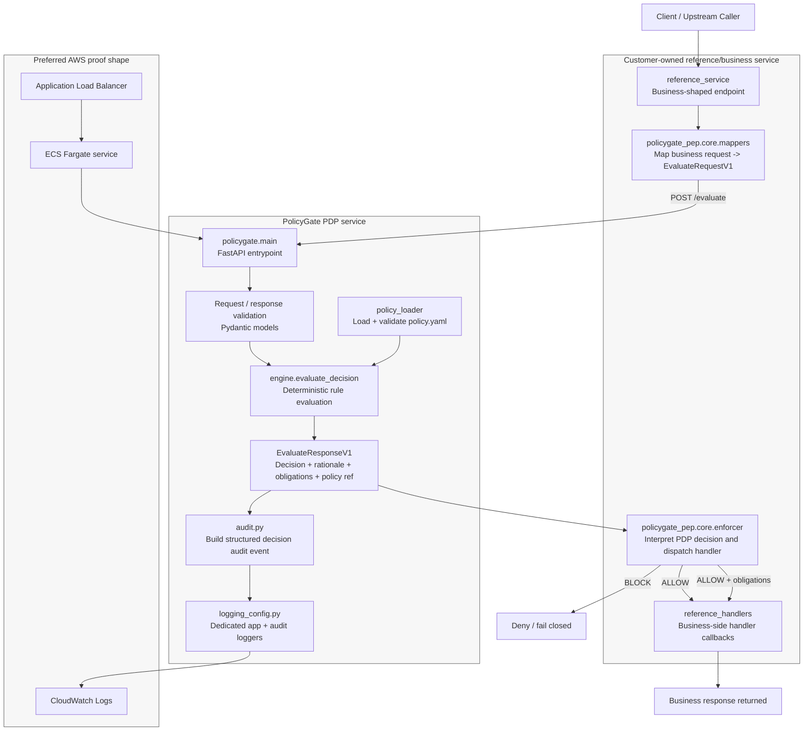

# PolicyGate Architecture

## Architecture notes

### 1. Product boundary
PolicyGate is a **deployable Policy Decision Point (PDP)** for internal AI or inference-related service flows.

It is intentionally narrow:

- receives policy-relevant facts at `POST /evaluate`
- evaluates them deterministically against loaded policy
- returns a small decision set, rationale codes, and any obligations
- emits a structured decision audit event

PolicyGate does **not** own customer business payloads, business semantics, or downstream business enforcement behaviour.

### 2. PDP / PEP separation
The repository is split deliberately:

- `policygate/`  
  core PDP runtime
- `policygate_pep/core/`  
  stable customer-side enforcement scaffolding
- `policygate_pep/reference/`  
  reference customer/business integration example

The intended enforcement boundary is:

- **PolicyGate decides**
- **customer-side code enforces**

This keeps business endpoints business-shaped while keeping decisioning generic and stable.

### 3. Request flow
Typical flow:

1. A client calls a customer-owned business or gateway endpoint.
2. The reference/customer service receives the business request.
3. `policygate_pep.core.mappers` derives a minimal `EvaluateRequestV1` from that request.
4. The service calls `POST /evaluate` on PolicyGate.
5. PolicyGate validates input, evaluates policy deterministically, and builds `EvaluateResponseV1`.
6. PolicyGate emits one structured decision audit event for the completed evaluation.
7. The reference/customer enforcer interprets the returned decision and dispatches to the appropriate handler.
8. The business service returns its business response.

### 4. Decision model
PolicyGate keeps a **small closed decision set**.

Nuance should be expressed through:

- rationale codes
- obligations
- matched rule identity
- policy identity / fingerprint

rather than by proliferating decision categories.

### 5. Mapping and enforcement
Customer-side mapping remains customer-owned because PolicyGate cannot safely infer application semantics automatically.

That means:

- business payloads stay outside the PDP
- only policy-relevant, audit-safe attributes are mapped into `EvaluateRequestV1`
- handlers act from the returned decision and obligations
- handlers do not need to re-read raw `signals`

### 6. Policy loading and evaluation
Policy is loaded from:

- `policy/policy.yaml`

and validated in two stages:

- schema validation
- semantic validation

The decision engine operates on normalized request data and deterministic rule matching, including nested dict matching where required.

### 7. Audit and logging
A completed evaluation emits **one structured decision audit event** built from:

- `EvaluateRequestV1`
- `EvaluateResponseV1`
- measured latency

Policy identity includes:

- `policy_id`
- `policy_version`
- `policy_sha256`

Logging is deliberately separated into:

- `policygate.app`  
  operational/service logs
- `policygate.audit`  
  structured decision audit logs

Both use UTC ISO-style timestamps suitable for container and cloud log collection.

### 8. Local deployment shape
Local proof has been completed with:

- Dockerised PolicyGate PDP
- working `/health`
- reachable `POST /evaluate`
- visible app and audit logs in container output
- successful reference-service flow calling the containerised PDP

This proves the service boundary and integration pattern locally before cloud deployment.

### 9. Preferred AWS proof shape
The preferred initial AWS proof shape is:

- ECR for image storage
- ECS Fargate for running the PDP service
- IAM task execution / task role configuration
- CloudWatch Logs for operational and audit visibility
- ALB as the preferred controlled HTTP ingress shape
- reference caller/service flow exercising the deployed PDP

ALB is included because likely callers may be internal or external depending on customer topology, and it provides the clearest demonstration shape.

### 10. Why this architecture is defensible
This architecture is the best current fit for PolicyGate because it proves:

- a real deployable runtime control component
- deterministic decisioning at a clean service boundary
- customer-owned mapping and enforcement
- audit-ready evidence generation
- credible AWS deployment shape without drifting into a broad governance platform
